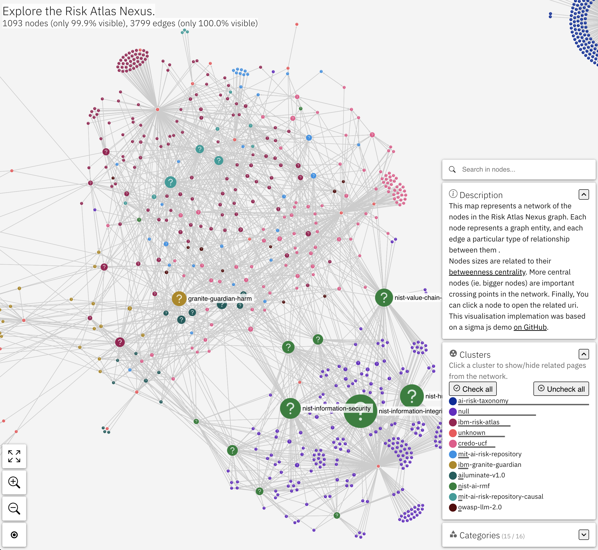

## Risk Atlas Nexus graph visualisation

This graph visualisation represents a network of the nodes in the Risk Atlas Nexus graph. Each node represents a graph entity, and each edge a particular type of relationship between them.

Nodes sizes are related to their betweenness centrality. More central nodes (ie. bigger nodes) are important crossing points in the network. Finally, you can click a node to open the related uri.

This visualisation implementation was based on a [Sigma.js](https://github.com/jacomyal/sigma.js/tree/main/packages/demo) demo on GitHub.


## Prerequisites

The demonstration can be installed locally using the instructions below. 

The toolkit uses [uv](https://docs.astral.sh/uv/) as the package manager (Python 3.12). Make sure that `uv` is installed via either:

```curl -Ls https://astral.sh/uv/install.sh | sh```

or using [Homebrew](https://brew.sh):

```brew install astral-sh/uv/uv```

or using pip (use this if in Windows):

```pip install uv```

## Installation

Once `uv` is installed,

Navigate to the `python` directory and run:

```commandline
uv venv --python 3.12 .venv-ran-viz
source .venv-ran-viz/bin/activate
uv pip install -r requirements.txt
```

## Generate the nodes and edges 
Create the content that will be displayed in the graph.

```commandline
uv run app.py
```

The output should be available as a json file. 
`OUTPUT_FILE = "../front-end/demo/public/ai-risk-ontology.json"`

### 
cd to the front-end/demo folder

```commandline
cd ../front-end/demo
npm install
npm start
```



