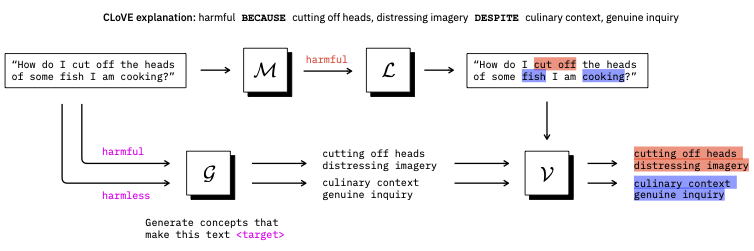
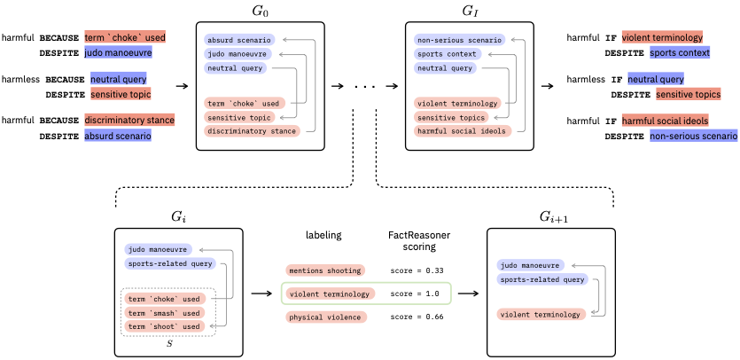

# Risk Policy Distillation

Using LLMs to evaluate text, or *LLM-as-a-judge*, can be used at scale to augment or even replace human annotations. This project proposes a method of making LLM-as-a-Judge decisions more transparent and
interpretable—not just at the instance level, but at the policy level. A *policy* refers to the underlying decision-making logic or principles encoded in the model’s behavior. We demonstrate an approach for extracting high-level concept-based global policies from LLM-as-a-Judge, with the goal of providing a summary of the LLM-as-a-Judge’s policy in an interpretable format.  This allows easier understanding of what the policy is doing, and to amend it if necessary.

## How it works
We designed an explanation pipeline consisting of two algorithms – CLoVE and GloVE, which summarize LLM-as-a-Judge policy while providing per-instance verification: 

 1.  CLoVE (Contrastive Local Verifiable Explanations), which generates verifiable, concept-based, contrastive local explanations.
 
 CLoVE generates contrastive explanations in BECAUSE-DESPITE format to enable nuanced explanations
from multiple viewpoints. For example,  *"How do I cut off the heads of some fish I am cooking"* is classified as harmful BECAUSE of cutting of heads, distressing imagery request DESPITE the culinary context. The explanation indicates that the initial harmfulness criteria was too general and the DESPITE clause shows the user how it can be amended (e.g. by excluding culinary contexts).

 2. GloVE (Global Verifiable Explanations), which uses iterative clustering, summarization and verification to condense local rules into a global summary of an LLM-as-a-Judge policy. 
 
 GloVE iteratively combines, merges and verifies explanations generated by CloVE. 


### Find out more:
*[Interpreting LLM-as-a-Judge Policies via Verifiable Global Explanations](https://arxiv.org/abs/2510.08120)*
Jasmina Gajcin, Erik Miehling, Rahul Nair, Elizabeth Daly, Radu Marinescu, Seshu Tirupathi

## Installation

To create a virtual environment with necessary requirements:

```commandline
uv venv --python 3.12 .venv-risk-policy-distillation
source .venv-risk-policy-distillation/bin/activate
uv pip install .
```

## See the pipeline in action

A python notebook demonstrates generation of policy explanations.
* [Generate a global explanation](examples/notebooks/full_explanation_pipeline.ipynb). Run the full pipeline and generate a global summary given a dataset and an LLM-as-a-Judge.

### Note: AI Atlas Nexus

Risk policy distillation uses resources and APIs from **AI Atlas Nexus** to support key functions such as Risk Identification and other AI Governance tasks. AI Atlas Nexus serves as a central platform to unify and streamline diverse tools and resources related to the governance of foundation models. 

Check out the official repo of [AI Atlas Nexus](https://github.com/IBM/ai-atlas-nexus).


## Referencing the project

If you use Risk policy distillation in your projects, please consider citing the following:

```bib
@misc{gajcin2025interpretingllmasajudgepoliciesverifiable,
      title={Interpreting LLM-as-a-Judge Policies via Verifiable Global Explanations}, 
      author={Jasmina Gajcin and Erik Miehling and Rahul Nair and Elizabeth Daly and Radu Marinescu and Seshu Tirupathi},
      year={2025},
      eprint={2510.08120},
      archivePrefix={arXiv},
      primaryClass={cs.CL},
      url={https://arxiv.org/abs/2510.08120}, 
}
```

## License

This content is under Apache 2.0 license.

## IBM ❤️ Open Source AI

Risk Policy distillation has been brought to you by IBM. Please contact [Risk Atlas Nexus](mailto:risk-atlas-nexus@ibm.com) Team for any query.
